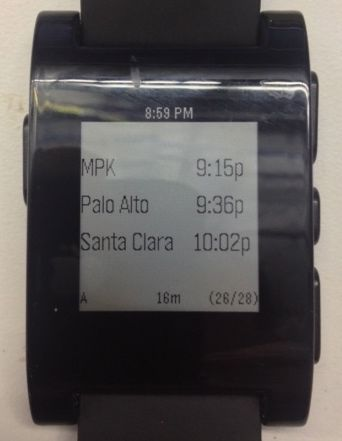

Train Scheduler
===============

Introduction
------------

This app helps you follow the schedule for a train, bus, whatever.
src/schedule.h defines the stations you care about. For example, you might have
the time a shuttle leaves for the train station, the time the train leaves, and
the time the train arrives at your stop. src/trainsched.c statically defines
the number of stations at 3, but you can adjust this value. If you add more
stations you'll need to tweak the GUI.

Screenshots
-----------

User Interface
--------------

Each screen shows a single schedule entry. The time for each stop will be
listed next to the name. If the time has already passed then the text is in
bold. The default screen shows the first entry that you haven't missed the
first stop for. You can hold 'Select' to return to this screen.

A short press sets an alarm (an 'A' should show up in the bottom left corner).
If this is set then 15 minutes before the first stop the watch will vibrate.
Note that due to limitations with the current Pebble SDK you must remain on
this screen to get the warning.

The bottom center status item on the bottom will show much time is left before
the next stop on the current screen.

The bottom right status item shows what screen you're on and how many screens
there are total.

Creating a Schedule
-------------------

To create your own schedule, load up src/schedule.h and start adding entries.
If you change the number of stations make sure you change NUM_STATIONS in
src/trainsched.c. Also make sure to adjust MAX_LOCATION_LEN if you have long
station names, but you'll have to tweak the UI to fit it.

TODO
----

* Create app icon
* Create alarm icon

Future TODO
-----------

These aren't possible or practical due to Pebble limitations, but would be nice
in the future.

* Set actual Pebble watch alarms
* Save alarm setting and selected screen when leaving the app
* Send schedules from phone to app

BUGS
----

* Hitting 'Select' to set an alarm usually doesn't work the first time the app is
opened. If select is hit again then the alarm gets set.
* App doesn't understand schedules that roll over into the next day. It will
  turn the station bold, for example, not realizing 12:01am is for the next
  day.

Authors
-------

* Zachary Landau (zlandau@jellofund.net)
* Michal Ludvig (https://github.com/mludvig/mini-printf) (wrote mini-printf)

